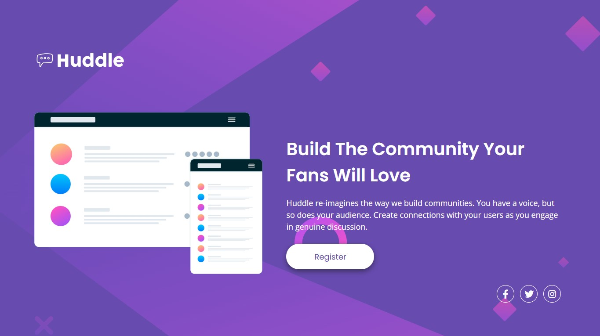
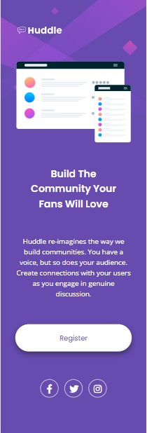

# Resolução do desafio da Huddle landing page

Este desafio teve por objetivo aprimorar nossas habilidades em codificação HTML e CSS avançados. Além da habilidade de pesquisa de informações adicionais que complementam a resolução.
###

# Desafio

- Habilidade de inferir apartir dos layouts fornecidos no design a estrutura html mais assertiva possível, aplicando os conhecimentos adquiridos;

- Habilidade de aplicar os conhecimentos em CSS avançados, como responsividade e estilização dos status ativos da página;

- Habilidade de pesquisar soluções em outras fontes além do curso e aplicá-las a resolução.
###

# Screenshots

## Desktop

## Mobile

###

# Linguagens e ferramentas utilizadas
- HTML5
- CSS avançado (flexbox)
- Font Awesome (versão 5.15.4)
- Google Fonts
- Stack Overflow
###

# Links

- Link da página: https://aline-aguiar.github.io/projeto-huddle-base/
- Font Awesome: https://fontawesome.com;
- Google Fonts: https://fonts.google.com;
- Stack Overflow: https://stackoverflow.com/
###

# Autor

- GitHub: [Aline Aguiar](https://github.com/Aline-Aguiar)
